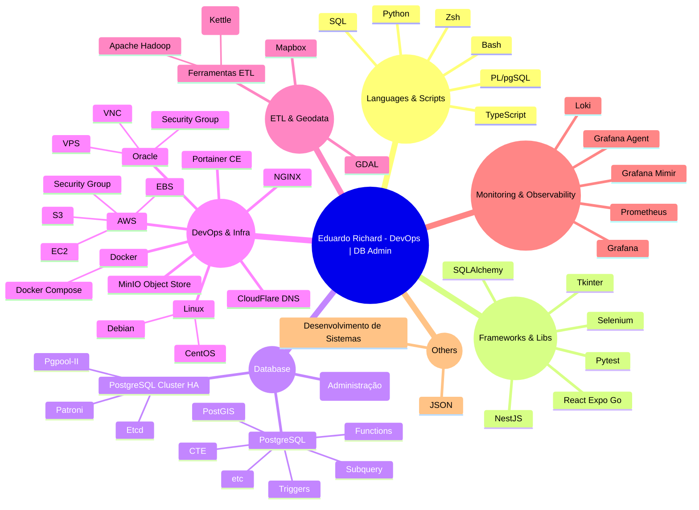

<h1 align="center"><a href="https://git.io/typing-svg"></a></h1>

<div align="center">
  
<a href="https://git.io/typing-svg" >

</a>

</div>


<br>

<p align="center">
  <a href="https://github.com/piyushsuthar/github-readme-quotes">
    
<!--      -->
  </a>
</p>

<br>

<p align="center">
  <a href="https://github.com/ryo-ma/github-profile-trophy">
    
  </a>
</p>


<br>

<details>
  <summary>
    <h2> A little more about me...
    </h2>
  </summary>
  <br>
  

```javascript

const eduardoRichard = {
  pronouns: "He" | "Him",
  code: ["Python", "TypeScript", "Bash", "PL/pgSQL"],
  askMeAbout: [
    "infraestrutura PostgreSQL HA (3 anos de experiência avançada)",
    "configuração e manutenção de clusters com Patroni e Pgpool-II",
    "monitoramento e métricas com Grafana, Prometheus e Loki",
    "automação de tarefas e rotinas em Python para DBAs",
    "DevOps com Docker, Kubernetes, AWS EC2 e orquestração de containers",
    "desenvolvimento back-end (NestJS) e front-end (React Native)",
    "modelagem e otimização de banco de dados PostgreSQL",
    "extensões PostgreSQL avançadas como PostGIS e triggers customizadas",
  ],
  technologies: {
    frontEnd: {
      js: ["React Native"],
      frameworks: ["Expo Go"],
      styling: ["css","tailwind"],
    },
    backEnd: {
      js: ["NestJS"],
      python: ["Flask (occasionally)", "Tkinter (GUI)"],
    },
    mobileApp: {
      crossPlatform: ["React Native"],
    },
    devOps: [
      "Docker",
      "Docker Compose",
      "Nginx",
      "AWS EC2",
      "AWS S3",
      "Oracle VPS",
      "Grafana Agent",
      "Grafana Mimir",
      "Prometheus",
      "Loki",
      "etcd",
      "Kubernetes (básico)",
    ],
    databases: [
      "PostgreSQL (3 anos experiência avançada)",
      "MySQL (3 anos experiência avançada)",
      "Patroni (failover automático e HA)",
      "Pgpool-II (balanceamento de carga e Watchdog)",
      "PostGIS (geoprocessamento e análise espacial)",
      "SQLAlchemy (integração e ORM Python)",
      "Triggers e funções PL/pgSQL customizadas",
      "MinIO e S3 (armazenamento de objetos)",
    ],
    misc: [
      "Zsh",
      "JSON",
      "GDAL",
      "Mapbox",
      "Jasper Reports",
      "Ferramentas ETL",
    ],
  },
  architecture: {
    frontEnd: ["SPA", "Mobile Apps"],
    backEnd: ["Microservices", "Monolithic"],
    devOps: [
      "Alta disponibilidade e tolerância a falhas",
      "CI/CD com Docker e Kubernetes",
      "Infraestrutura como código",
    ],
    databases: [
      "Modelagem relacional avançada",
      "Replicação síncrona e assíncrona no PostgreSQL",
      "Backup e recuperação com pgBackRest",
      "Escalabilidade e performance em clusters",
    ],
  },
  currentFocus: "Criar infra PostgreSQL HA robusta com monitoramento e automação eficiente",
  funFact: "Consigo debugar clusters complexos enquanto tomo café ☕️",
};

```

### ⚡ Tech Snapshot



</details>

<br>

<details>
  <summary>
    <h2> Contact Me
    </h2>
  </summary>
  <br>

  <p align="center" style="font-size: 1.2rem; line-height: 2.2;">
    💌 <a href="mailto:eduardorichwrd@gmail.com" style="text-decoration:none; color: inherit;">eduardorichwrd@gmail.com</a> &nbsp;&nbsp;&nbsp;|&nbsp;&nbsp;&nbsp;
    💬 <a href="https://discord.gg/CbsNwUh5wz" target="_blank" rel="noopener noreferrer" style="text-decoration:none; color: inherit;">Discord</a> &nbsp;&nbsp;&nbsp;|&nbsp;&nbsp;&nbsp;
    ✍️ <a href="https://dev.to/richwrd.dev" target="_blank" rel="noopener noreferrer" style="text-decoration:none; color: inherit;">Dev.to</a>
  </p>

</details>

<br>

<details> 
  <summary>
    <h2>
       Stats and Activity
    </h2>
  </summary>

  <h3>🔥 Streak Stats</h3>

  <p>
    <a href="https://github.com/richwrd/github-readme-streak-stats">
      <!-- Use https://streak-stats.demolab.com or self-host with your own Vercel app - visit https://git.io/streak-stats for instructions -->
      
    </a>
   <blockquote>🔥 Get streak stats for your profile at <a href="https://git.io/streak-stats">git.io/streak-stats</a></blockquote>
  </p>

  <h3>💻 GitHub Profile Stats</h3>

  <!-- https://github.com/anuraghazra/github-readme-stats -->

  <a href="https://github.com/anuraghazra/github-readme-stats"></a>
  <a href="https://github.com/anuraghazra/github-readme-stats"></a>
  <br/>

  <blockquote>Note: Top languages is only a metric of the languages my public code consists of and doesn't reflect experience or skill level.</blockquote>
  
  <a href="https://github.com/ashutosh00710/github-readme-activity-graph"></a>

</details>
<br>

<details>
   <summary>
    <h2> Comments
    </h2>
  </summary>

<p align="center">
  Deixe seu comentário ou vibe aqui!  
  Pode ser um feedback, uma ideia ou apenas um "oi" ✨
</p>


<br>
 
<div align="center">


<table>
  <tr>
    <td>
      <a href="https://github.com/richwrd/richwrd/issues/1" target="_blank">
       
      </a>
    </td>
    <td>
      <a href="https://github.com/richwrd/richwrd/issues/1" target="_blank">
        
      </a>
    </td>
<!--     <td>
      <a href="https://github.com/richwrd/richwrd/issues/1" target="_blank">
        
      </a>
    </td> -->
  </tr>
</table>

</div>


<div align="center">
  
<!-- Guestbook -->
| Name | Date | Message |
|---|---|---|
| <a href="https://github.com/KarlaDuarte87"> KarlaDuarte87</a> |6/5/2025, 2:02:23 AM|Boraaaaaa!!!!!|
| <a href="https://github.com/richwrd"> richwrd</a> |6/5/2025, 12:05:28 AM|Muito dhr! slc|
<!-- /Guestbook -->

</div>


</details>


<br>


<h1 align='center'>⚡️<i>Stay awesome!</i>⚡️</h1>
<table align="center">
  <tr>
    <th>⏰ UTC Time</th>
  </tr>
  <tr>
    <td align="center">
      
    </td>
  </tr>
</table>

<br>

<p align="center"> 
  Visitors count<br>
  
</p>

<p align="center">
  
</p>
